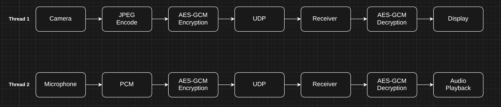
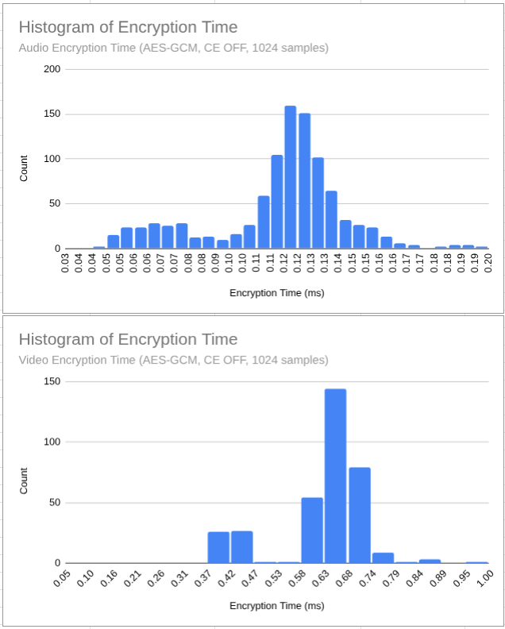
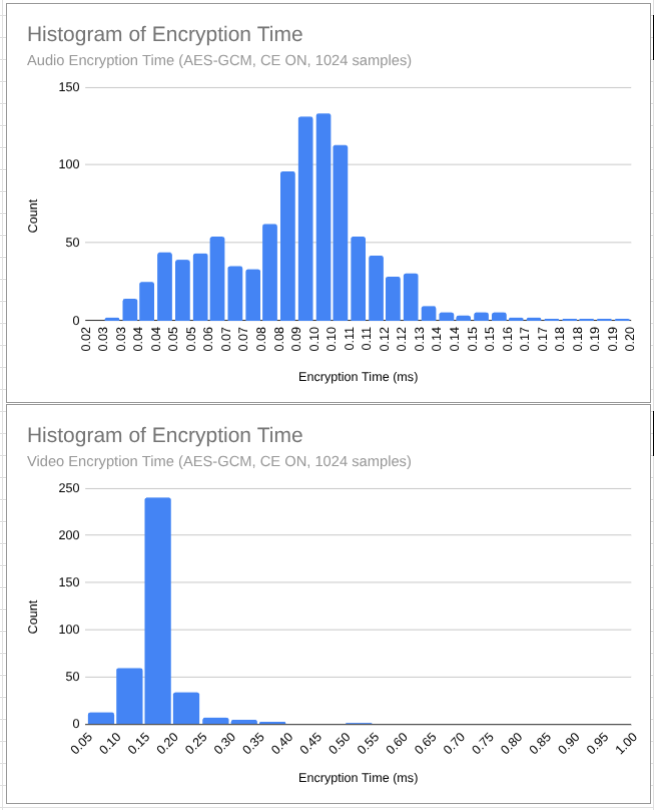

# Real-Time Encrypted Audio/Video Streaming (Raspberry Pi 5)

A real-time UDP-based audio/video streaming system with AES-256-GCM encryption, implemented using Python and Rust and optimized with ARMv8 hardware cryptographic acceleration. This project evaluates real-time encrypted audio/video streaming on a Raspberry Pi 5, leveraging ARMv8 cryptographic extensions.

## Tech Stack

- Python (streaming + orchestration)
- Rust (AES-GCM encryption via OpenSSL)
- Raspberry Pi 5 (ARM Cortex-A76)
- OpenCV + Picamera2
- PyAudio
- Linux `perf` (CPU profiling)

### Code Abstraction



## Demo

[](https://www.youtube.com/watch?v=i9FQLvJkTHk)

## Key Results

- Up to **~4× improvement in video encryption throughput**
- ~30% improvement in audio encryption throughput
- ~5% reduction in CPU cycles and improved CPI using ARMv8 crypto extensions
- Full system evaluation: latency, jitter, packet loss, and CPU performance

### Experimental Setup

- **Sender:** Raspberry Pi 5 (ARM Cortex-A76, ARMv8 Crypto Extensions)
- **Receiver:** x86 system
- **Transport:** UDP
- **Video:** 640x480 JPEG, 15 FPS
- **Audio:** 44.1 kHz PCM
- **Crypto:** AES-256-GCM (OpenSSL via Rust)
- **Modes Tested:**
  - Hardware acceleration enabled (`CRYPTO_MODE=auto`)
  - Hardware acceleration disabled (`CRYPTO_MODE=off`)

---

### Encryption Time

| CE OFF | CE ON |
|------|---------------|
|  |  |

### Summary

| Workload | CE ON | CE OFF | Speedup |
|--------|------|--------|--------|
| Audio | 24.99 MB/s | 18.69 MB/s | ~1.3× |
| Video | 209.20 MB/s | 57.36 MB/s | ~3.6× |

### Encryption Throughput

| Metric | Audio (CE ON) | Audio (CE OFF) | Video (CE ON) | Video (CE OFF) |
|------|---------------|---------------|--------------|--------------|
| Mean (MB/s) | 24.99 | 18.69 | 209.20 | 57.36 |
| Median (MB/s) | 21.99 | 16.83 | 199.38 | 53.75 |
| P95 (MB/s) | 45.69 | 34.02 | 334.39 | 84.35 |

**Key Observations:**

- Audio throughput improved by ~1.3× with hardware crypto
- Video throughput improved by ~3.5–4×
- Larger payloads benefit significantly more from hardware acceleration

---

### CPU Performance (perf)

| Metric | CE ON | CE OFF | Improvement |
|------|------|--------|------------|
| Cycles | 8.12B | 8.50B | ↓ ~4.5% |
| Instructions | ~11.86B | ~11.84B | ~same |
| CPI | 0.684 | 0.718 | ↓ ~5% |

**Insights:**

- Instruction count remains constant → same algorithm
- Cycle count decreases → faster execution per instruction
- Improved CPI confirms more efficient CPU utilization

---

### System-Level Observations

- Encryption throughput improved up to **4×**, but total CPU reduction was ~5%
- This indicates that encryption is only part of the pipeline
- Other bottlenecks include:
  - Image capture
  - JPEG encoding
  - Network transmission

---

### Receiver Performance

Receiver analysis focused on:

- End-to-end latency
- Jitter
- Packet loss
- Audio underruns

Crypto acceleration had minimal impact on receiver CPU performance, indicating that decryption is not the dominant workload.

---

### Summary

- ARMv8 crypto extensions significantly improve encryption throughput
- Performance gains scale with payload size
- Hardware acceleration reduces cycles-per-byte and improves CPI
- End-to-end performance is bounded by non-crypto pipeline stages

---

## Running the System

### 1. Install dependencies

On Raspberry Pi 5:

```bash
pip install -r requirements.sender.txt
cargo build --release
```

On PC:

```bash
pip install -r requirements.receiver.txt
cargo build --release
```

### 2. Configure environment

```bash
cp .env.example .env
```

### 3. Run Sender/Receiver

On Raspberry Pi 5:

```bash
python3 ./Sender
```

PC:

```bash
python3 ./Receiver
```
