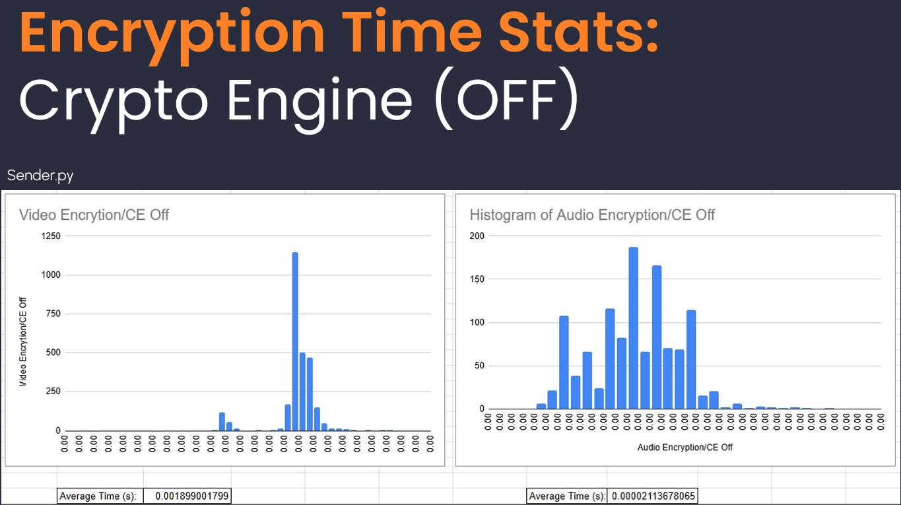
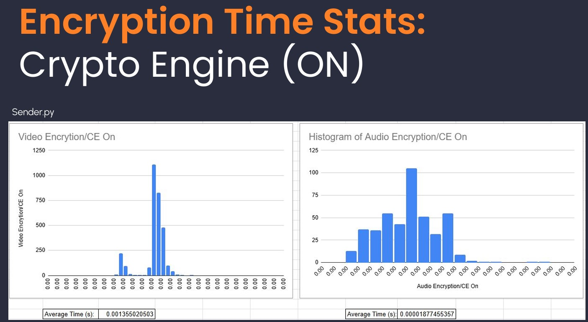

# Raspberry Pi 5 Transceiver

Secure, bidirectional **video + audio streaming** over a LAN, built on a Raspberry Pi 5 with **Python control logic** and **Rust-based encryption** that leverages the Pi 5’s hardware crypto engine.  

---

## Features
- **Bidirectional live streaming** of video (Pi Camera Module 2) and audio (USB microphone)  
- **End-to-end encryption** implemented in Rust for security + performance  
- Uses the Raspberry Pi 5 **crypto engine** for efficient, low-latency encryption  
- **Python control logic** for stream orchestration  
- Configurable **bitrate and resolution** (roadmap: move to `.env` for user control)  
- LAN-based for private, secure use cases (doorbell cameras, local surveillance, secure comms)  

---

## Hardware
- Raspberry Pi 5 (16 GB)  
- Pi Camera Module 2  
- USB Microphone  
- Local Wi-Fi network  

---

## Software Stack
- **Python**: Orchestration, device control, streaming pipeline  
- **Rust**: Encryption logic (no garbage collection → lower latency, predictable performance)  
- **Dependencies**:  
  - Python: `opencv-python`, `pyaudio`, `requests`, `python-dotenv`  
  - Rust: `tokio`, `aes-gcm` (or whichever crypto crates you used), `serde`  

---

## Getting Started

### 1. Clone repo
```bash
git clone https://github.com/Sebgra518/Raspbery-Pi-5-Transceiver.git
cd Raspbery-Pi-5-Transceiver
```

### 2. Install Python dependencies
```bash
python3 -m venv .venv
source .venv/bin/activate
pip install -r requirements.txt
```

### 3. Install Rust dependencies
```bash
cd rust-encryption
cargo build --release
```

### 4. Run the transceiver

On both Pis (or two terminals):
```bash
python3 Sender.py
python3 Receiver.py
```

---

###Flow
```bash
[Camera + Mic] --(Python Capture)--> [Rust Encryption] --LAN--> [Rust Decryption] --(Python Playback)--> [Screen + Speaker]
```

-Video captured from Pi Camera Module 2
-Audio captured from USB microphone
-Encrypted in Rust using Pi 5’s hardware crypto engine
-Transmitted over LAN
-Received, decrypted, and rendered live

## Performance Analysis
For details on performance, including CPI and power consumption benchmarks (crypto engine vs software-only), see the [full report](docs/performance-analysis.pdf).

### Encryption Time Comparison
**Without Crypto Engine**


**With Crypto Engine**

